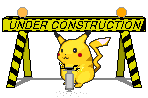
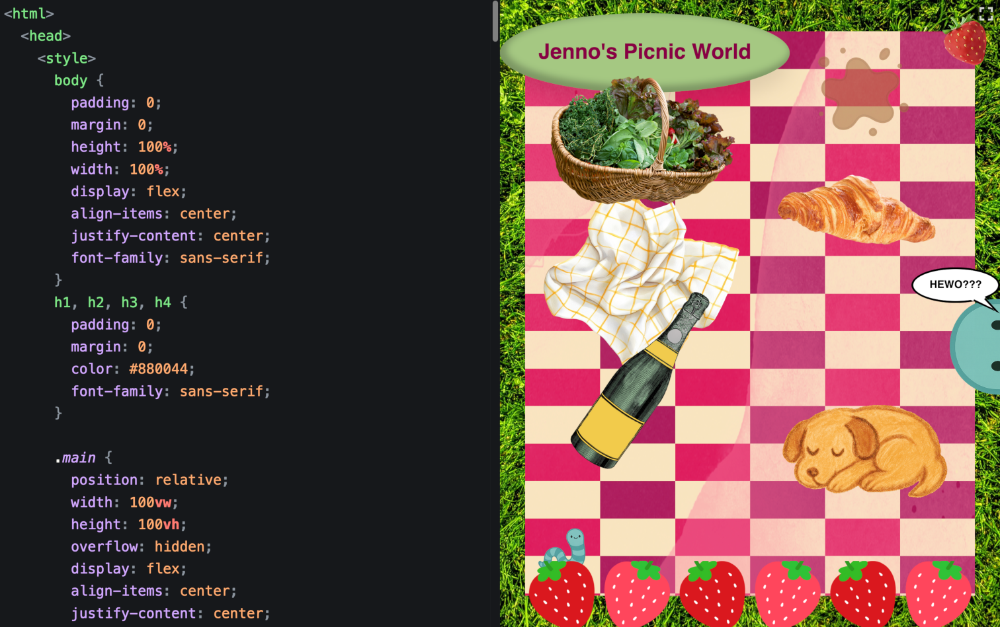
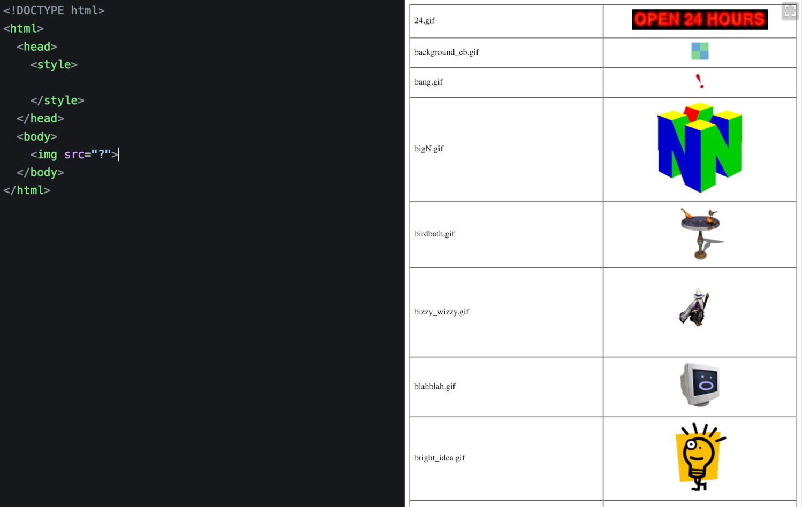
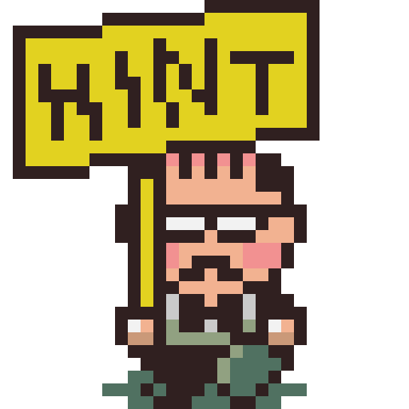
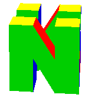

# Web Workshop 🚧

Craft handmade websites in their natural habitat (your web browser).

<a href="https://hunterirving.github.io/web_workshop/">
</a><br><br>

Web Workshop was born as a teaching tool for web development classes, with the goal of making web publishing more accessible, especially to those who have never written code before.

By stripping away complexity and focusing on the basics, Web Workshop turns website building into something playful and toylike – a creative playground where you can experiment, break things, and watch your ideas materialize in real-time.

<a href="https://hunterirving.github.io/web_workshop/">
</a>
<br><br>

Recently, Web Workshop has become an editor of choice for <a href="https://html.energy/html-day/2025/index.html">HTML Day</a>, an annual celebration of handmade websites and the creative web.

## Built with Web Workshop
- [Hunter's Club-Mate Fan Club](https://hunterirving.github.io/web_workshop/pages/club-mate) - A shrine to the beloved hacker beverage
- [Hunter's Trinket Collection](https://hunterirving.github.io/web_workshop/pages/trinkets) - A virtual museum to house five cherished tchotchkes
- [SNAKE](https://hunterirving.github.io/web_workshop/pages/snake) - The classic game, reimagined for the modern era
- [Jenno's Picnic World](https://hunterirving.github.io/web_workshop/pages/jennos_picnic_world) - An interactive digital collage

## How to Play

1. Open `index.html` in your web browser (<a href="https://hunterirving.github.io/web_workshop/">click here</a>!)
2. Type some HTML in the editor pane
    - The preview pane will rerender when you're done typing
    - Your work is automatically saved, and restored when you reload the page
3. Press `⌘ + S` to export your work as an HTML file (`⌘ + O` to open an existing file)

## Stock Images
A library of stock images is included for your convenience. To browse them, type `` anywhere in the editor pane, then click to select an image from the resulting table.

<a href="https://hunterirving.github.io/web_workshop/">
</a>
<br><br>

Alternatively, if you know the name of the image you'd like to use, you can add it to your project like so: ``.

## Boilerplate
Type `<!>` to insert the following starter HTML:

```html
<!DOCTYPE html>
<html>
  <head>
    <style>
      
    </style>
  </head>
  <body>
    
  </body>
</html>
```

## Options
- to toggle <b>line numbers</b>, press <kbd>F1</kbd> (disabled by default)
- to toggle <b>line wrapping</b>, press <kbd>F2</kbd> (enabled by default)

## Installation for Offline Use

<i>
Wanna make websites on your phone? Try installing Web Workshop as a <a href="https://hunterirving.github.io/web_workshop/pages/pwa">Progressive Web App</a>!</i>
<br>(You can install it as a desktop app, too...)

## Technologies Used

- [CodeMirror 6](https://codemirror.net/)
- [GitHub Dark Theme for CodeMirror](https://github.com/fsegurai/codemirror-themes)


## License

GPLv3 (see <a href="LICENSE">LICENSE</a> for details).

<br>


## Contributing

Feel free to open issues or submit pull requests for improvements!


